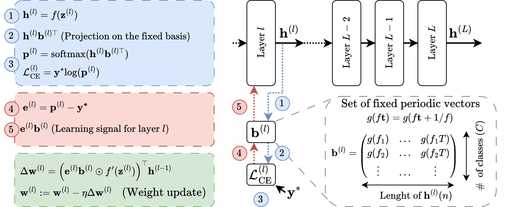

# LLS: Local Learning Rule for Deep Neural Networks Inspired by Neural Activity Synchronization


This repository is the official implementation of LLS, a local learning rule for training deep neural networks (DNNs), and replicates the experimental results obtained on the MNIST, FashionMNIST, CIFAR10, CIFAR100, TinyIMAGENET, IMAGENETTE, and Visual Wake Words (VWW) datasets. Its primary purpose is to aid in understanding the methodology and reproduce essential results. 

[[arXiv Paper]](https://arxiv.org/abs/2405.15868)

## Abstract
Training deep neural networks (DNNs) using traditional backpropagation (BP) presents challenges in terms of computational complexity and energy consumption, particularly for on-device learning where computational resources are limited. Various alternatives to BP, including random feedback alignment, forward-forward, and local classifiers, have been explored to address these challenges. These methods have their advantages, but they can encounter difficulties when dealing with intricate visual tasks or demand considerable computational resources. In this paper, we propose a novel Local Learning rule inspired by neural activity Synchronization phenomena (LLS) observed in the brain. LLS utilizes fixed periodic basis vectors to synchronize neuron activity within each layer, enabling efficient training without the need for additional trainable parameters. We demonstrate the effectiveness of LLS and its variations, LLS-M and LLS-MxM, on multiple image classification datasets, achieving accuracy comparable to BP with reduced computational complexity and minimal additional parameters. Specifically, LLS achieves comparable performance with up to $300\times$ fewer multiply-accumulate (MAC) operations and half the memory requirements of BP. Furthermore, the performance of LLS on the Visual Wake Word (VWW) dataset highlights its suitability for on-device learning tasks, making it a promising candidate for edge hardware implementations.

<p align = "center">

</p>
<p align = "center">
Overview of LLS.
</p>

## How to Use

1. Install the required dependencies listed in `requirements.txt`. 
2. Use the following command to run an experiment:

    ```shell
    python main.py --param-name param_value
    ```

    A description of each parameter is provided in `main.py`.

## Reproducing Results in the Paper

To ensure reproducibility, we have provided a bash script (`./script.sh`) with all the commands used to obtain the results reported in Tables 1, 2, and 3 of the paper.

## Citation

If you use this code in your research, please cite our paper:

```bibtex
@article{apolinario2024llslocallearningrule,
      title={LLS: Local Learning Rule for Deep Neural Networks Inspired by Neural Activity Synchronization}, 
      author={Marco Paul E. Apolinario and Arani Roy and Kaushik Roy},
      journal={arXiv preprint arXiv:2306.15220},
      year={2024},
      eprint={2405.15868},
      archivePrefix={arXiv},
      primaryClass={cs.NE},
      url={https://arxiv.org/abs/2405.15868}, 
}
```


## Acknowledgments

We have utilized several publicly available repositories for specific functionalities in our work:

- For Schedule-Free SGD and AdamW optimizers, we used the code implementation from: [schedule_free](https://github.com/facebookresearch/schedule_free).
- For DFA experiments, we used the code implementation from: [DirectRandomTargetProjection](https://github.com/ChFrenkel/DirectRandomTargetProjection).
- For downloading the VWW dataset, we used the repository: [visualwakewords](https://github.com/Mxbonn/visualwakewords).
- For downloading the IMAGENETTE dataset, we used the repository: [imagenette](https://github.com/fastai/imagenette).
